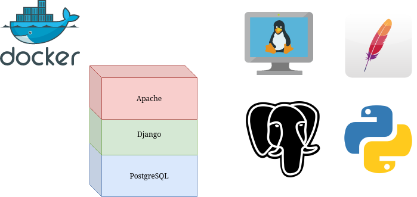

# Django with Apache and PostgreSQL in a separate container

This a capstone project at our school for our final year, at first I didn't apply docker because we want it to be simple and not complicating it for our final year project. After months of studying docker and docker compose, I have finally dockerized my capstone project, well I mean most of it, regular http is not working at the moment and only support https protocol.



## Create network 

```
docker create network -d bridge <network-name>
```


## Build and run manually
* Build and run the django image

```
docker build --no-cache -t django:1.0 .
docker run --name django -h django -d --net <network-name> -v $(pwd)/Django/Capstone_16ES:/capstone django:1.0 ./run.sh 
```

* Run the postgres image

```
docker run --name postgres --net <network-name> -h postgres -p 5432:5432 -e POSTGRES_USER=<user> \ -e POSTGRES_PASSWORD=<password> -e POSTGRES_DB=db -d
```

* Building and running Apache image

```
docker build --no-cache -t apache:1.0 .
docker run --name apache -h apache --volumes-from django \ 
-v $(pwd)/Apache/httpd-config/my-httpd.conf:/usr/local/apache2/conf/httpd-conf \
-v $(pwd)/Apache/httpd-config/capstone.conf:/usr/local/apache2/conf/extra/httpd-vhosts.conf \
-v $(pwd)/Apache/httpd-config/my-httpd-ssl.conf:/usr/local/apache2/conf/extra/httpd-ssl.conf \
-v $(pwd)/cert:/usr/local/apache2/conf/ \
-v $(pwd)/mime.types:/usr/local/apache2/conf/mime.types --net <network-name> -p 80:80 -p 443:443 apache:1.0 httpd -D FOREGROUND
```

## Build and run with a composer
* Building and running with docker compose 

```
docker-compose up
```

## Run with Docker Swarm
* Generate swarm token 

```docker
docker swarm init
```

* Copy the token generated and run 

```
docker swarm join --token <generated-token> <manager-ip>:<port-generated>
```

* Create an overlay network for swarm to work
The name corresponding to the name of the network in the compose file 

```
docker network create -d overlay <network-name>
```

* Deploy with a docker compose file

```
docker stack deploy -c <compose-name> <name>
```

* **Optional** Scale the service

```
docker service scale <service-name>=<number-of-task>
```

## Restricton
* This swarm can only scale the Django app and Web App, not the database, because of stability. When Django trying to connect to the database with its IP address, Django assume there is only one database with one IP address. But when we scale the database in the swarm, docker swarm create more database task, which mean that there are two database services with the same IP address, those databases conflict with eachother causing Django to panic and gives out error 


